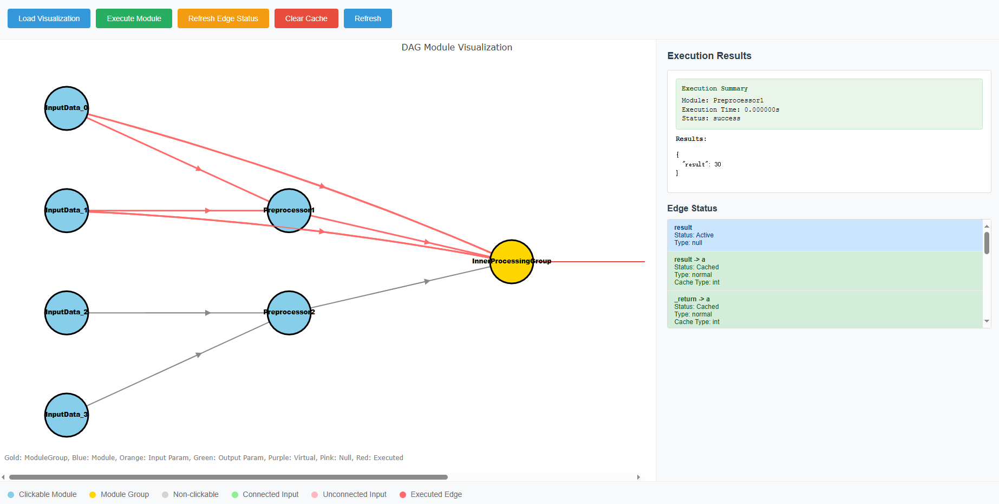
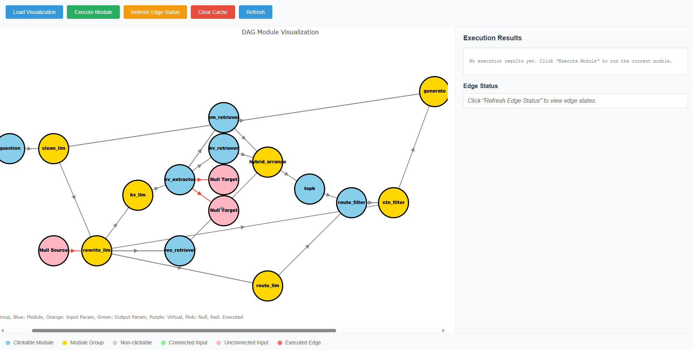

# DAG Package - Computational Graph Framework

A powerful Directed Acyclic Graph (DAG) computational framework that supports modular programming, intelligent caching, visualization debugging, and interactive web interfaces.

## 🚀 Core Features

- **Modular Computing**: Decompose complex computations into reusable modules
- **Intelligent Caching**: Automatically cache computation results to avoid redundant calculations
- **Visualization Debugging**: Both text and web-based visualization methods
- **Flexible Extension**: Support for custom modules and functional programming
- **Type Checking**: Automatic inference and validation of input/output types

## 🎯 Basic Concepts

### Core Components
- **Module**: Computational unit, can be simple functions or complex algorithms
- **Edge**: Data flow connections between modules
- **ModuleGroup**: Module container that organizes multiple modules into larger computational units
- **connect()**: Connection function to establish data flow between modules

## 📊 Simple Graph Example

Create a simple computational graph that calculates `(a + b) * c`:

```python
from dag.node import Constant, Addition, Multiplication, connect
from dag.inspect_utils import print_module, visualize_module

# Create input nodes
a = Constant(name="InputA")
a.input(10)  # Set constant value

b = Constant(name="InputB") 
b.input(20)

c = Constant(name="InputC")
c.input(3)

# Create computation nodes
add_node = Addition(name="Add")
mul_node = Multiplication(name="Multiply")

# Establish connections: (a + b) * c
connect(a, "_return", add_node, "a")     # a -> add.a
connect(b, "_return", add_node, "b")     # b -> add.b
connect(add_node, "result", mul_node, "a")  # add.result -> mul.a
connect(c, "_return", mul_node, "b")     # c -> mul.b

# Execute computation
result = mul_node()
print(f"Result: {result['result']}")  # Output: 90

# Text visualization
print_module(mul_node)

# Web visualization
visualize_module(mul_node, port=5000)
```

## 🏗️ Complex Graph Example

Create complex hierarchical structures with module groups:

```python
from dag.node import Constant, Addition, Multiplication, ModuleGroup, connect
from dag.inspect_utils import visualize_module

def create_complex_pipeline():
    # === Data Preprocessing Layer ===
    raw_data_1 = Constant(name="RawData1")
    raw_data_1.input(100)
    
    raw_data_2 = Constant(name="RawData2")
    raw_data_2.input(200)
    
    raw_data_3 = Constant(name="RawData3")
    raw_data_3.input(50)
    
    # Preprocessing modules
    preprocessor1 = Addition(name="Preprocessor1") 
    preprocessor2 = Multiplication(name="Preprocessor2")
    
    # === Core Processing Layer ===
    # Create internal processing modules
    core_add = Addition(name="CoreAdd")
    core_mul = Multiplication(name="CoreMultiply") 
    core_final = Addition(name="CoreFinal")
    
    # Internal connections
    connect(core_add, "result", core_mul, "a")
    connect(core_mul, "result", core_final, "a")
    
    # Create processing group
    core_group = ModuleGroup(
        name="CoreProcessingGroup",
        modules=[core_add, core_mul, core_final]
    )
    
    # === Establish Data Flow ===
    # Preprocessing connections
    connect(raw_data_1, "_return", preprocessor1, "a")
    connect(raw_data_2, "_return", preprocessor1, "b") 
    connect(raw_data_2, "_return", preprocessor2, "a")
    connect(raw_data_3, "_return", preprocessor2, "b")
    
    # Connect to core processing group
    connect(preprocessor1, "result", core_group, "a")        # Maps to core_add.a
    connect(preprocessor2, "result", core_group, "b")        # Maps to core_add.b  
    connect(raw_data_1, "_return", core_group, "b.2")        # Maps to core_final.b
    
    return core_group

# Create and execute
pipeline = create_complex_pipeline()
result = pipeline()
print(f"Pipeline result: {result}")

# Visualize complete pipeline
visualize_module(pipeline, port=5001)
```

## 📖 Visualization Features

### 1. Text Visualization - print_module()

```python
from dag.inspect_utils import print_module

# Basic information
print_module(module)

# Detailed information + tree structure
print_module(module, detailed=True, tree_view=True, max_depth=3)
```

**Output Example:**
```
📦 ModuleGroup: CoreProcessingGroup
========================================
🔧 Parent: None
📊 Input Count: 3
📤 Output Count: 1

📥 INPUTS:
----------------------------------------
  • a
    Status: 🟢 Cached (dict)
    Source: <Preprocessor1>
  • b  
    Status: 🟢 Cached (dict)
    Source: <Preprocessor2>
  • b.2
    Status: 🟢 Cached (dict) 
    Source: <RawData1>

📤 OUTPUTS:
----------------------------------------
  • result
    [0] Status: 🟢 Cached (dict)
    [0] Target: <Next Module>
```

### 2. Web Visualization - visualize_module()

```python
from dag.inspect_utils import visualize_module

# Launch web interface
visualize_module(module, port=5000, debug=True)
```

**Output Example:**



## 🛠️ Custom Nodes

### Method 1: Inherit from InspectModule

```python
from dag.node import InspectModule, returns_keys, Constant, connect

class CustomProcessor(InspectModule):
    def __init__(self, name="CustomProcessor", multiplier=2):
        super().__init__(name)
        self.multiplier = multiplier
    
    @returns_keys(processed_result=float)
    def forward(self, data, weight):
        """Custom processing logic
        
        Args:
            data: Input data
            weight: Weight parameter
            
        Returns:
            dict: Processing result
        """
        processed = data * weight * self.multiplier
        return {"processed_result": processed}

# Use custom module
processor = CustomProcessor(name="MyProcessor", multiplier=3)

input_data = Constant(name="Data")
input_data.input(10)

weight_data = Constant(name="Weight")
weight_data.input(0.5)

connect(input_data, "_return", processor, "data")
connect(weight_data, "_return", processor, "weight")

result = processor()
print(result)  # {'processed_result': 15.0}
```

### Method 2: Use FunctionModule

```python
from dag.node import FunctionModule, returns_keys, Constant, connect

# Use decorator to automatically infer input/output
@returns_keys(mean=float, variance=float, count=int)
def statistical_analysis(numbers, weights=None):
    """Statistical analysis function
    
    Args:
        numbers: List of numbers
        weights: Optional weights
        
    Returns:
        tuple: (mean, variance, count)
    """
    if weights is None:
        weights = [1.0] * len(numbers)
    
    weighted_sum = sum(n * w for n, w in zip(numbers, weights))
    total_weight = sum(weights)
    mean = weighted_sum / total_weight
    
    variance = sum(w * (n - mean) ** 2 for n, w in zip(numbers, weights)) / total_weight
    count = len(numbers)
    
    return {
        "mean": mean,
        "variance": variance,
        "count": count
    }

# Create function module
stats_module = FunctionModule(
    func=statistical_analysis,
    name="StatisticalAnalyzer"
)

# Input data
numbers_input = Constant(name="Numbers")
numbers_input.input([1, 2, 3, 4, 5])

weights_input = Constant(name="Weights")
weights_input.input([1, 1, 2, 2, 1])

# Establish connections
connect(numbers_input, "_return", stats_module, "numbers")
connect(weights_input, "_return", stats_module, "weights")

# Execute analysis
results = stats_module()
print(f"Mean: {results['mean']}")
print(f"Variance: {results['variance']}")
print(f"Count: {results['count']}")
```

## 🔍 returns_keys Decorator

The `@returns_keys` decorator enables functions to automatically infer and validate input/output:


## 🎛️ Advanced Features

### Cache Control
```python
from dag.node import clear_cache

# Clear specific module cache
clear_cache(module)
```

### Debug Support
```python
from dag.dbg import set_debug_state, DebuggingContext

# Enable debugging globally
set_debug_state(True)

# Or use context manager
with DebuggingContext(enable=True):
    result = module()
    # Automatically output execution time statistics
```

### Module Statistics
```python
from dag.node import get_module_stats, reset_module_stats

# Get execution statistics
stats = get_module_stats(module, recursive=True)
print(f"Execution time: {stats['execution_time']:.6f}s")
print(f"Call count: {stats['call_count']}")

# Reset statistics
reset_module_stats(module)
```

## 📋 API Reference

### Core Classes
- `Module`: Base module class
- `InspectModule`: Inspectable module base class
- `FunctionModule`: Function wrapper module
- `ModuleGroup`: Module group container
- `Constant`: Constant input module

### Built-in Modules
- `Addition`: Addition operation
- `Multiplication`: Multiplication operation  

### Utility Functions
- `connect(src, src_key, tgt, tgt_key)`: Connect modules
- `clear_cache(module)`: Clear cache
- `print_module(module, **kwargs)`: Text visualization
- `visualize_module(module, **kwargs)`: Web visualization

### Decorators
- `@returns_keys(**kwargs)`: Specify function return key names and types

---

### An Retrieval Augmented Generation System


---

🚀 **DAG Package - Making Complex Computations Simple and Intuitive!**

